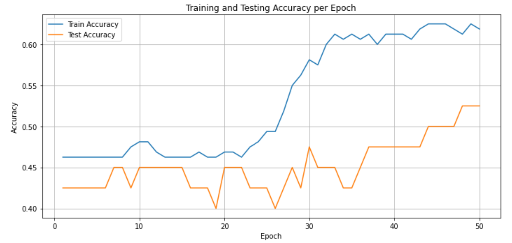

# 🧠 Seizure Prediction MLOps API

This project demonstrates how a machine learning model trained on EEG-like features can be deployed as a RESTful API using Flask. The use case is focused on seizure prediction using simulated biomedical signal data.

---

## 📁 Project Structure

| File/Folder                        | Description |
|-----------------------------------|-------------|
| `Seizure_Prediction_MLOPs_API.ipynb` | Jupyter notebook with data simulation, preprocessing, model training, and plotting. |
| `seizure_model.pkl`               | Serialized trained model saved using `joblib`. |
| `serve_model.py`                  | Python script to deploy the trained model via a REST API using Flask. |
| `requirements.txt`                | List of required Python packages. |
| `README.md`                       | Project overview and instructions. |

---

## 📊 Accuracy Plot

Here’s how the model performed over 50 epochs on training and test sets:



---

## 🚀 How to Run This Project

1. **Clone the repo**:
   ```bash
   git clone https://github.com/your-username/seizure-prediction-mlops.git
   cd seizure-prediction-mlops
   ```

2. **Install dependencies**:
   ```bash
   pip install -r requirements.txt
   ```

3. **Start the API**:
   ```bash
   python serve_model.py
   ```

4. **Make a prediction (using curl)**:
   ```bash
   curl -X POST http://127.0.0.1:5000/predict -H "Content-Type: application/json" -d "{\"mean_bandpower\": 6.5, \"spike_count\": 3, \"frequency_variation\": 1.2}"
   ```

   ✅ Example output:
   ```json
   {
     "prediction": 0
   }
   ```

---

## 🧠 Model Details

- Model: `MLPClassifier` from scikit-learn
- Features: `mean_bandpower`, `spike_count`, `frequency_variation`
- Training samples: 200 (simulated)
- Performance: Evaluated over 50 epochs with plotted train/test accuracy

---

## 📌 Future Work

- Use real EEG/iEEG data (e.g., from the European Epilepsy Dataset)
- Deploy using Docker
- Host API on cloud (AWS, GCP, or Heroku)

---

## 🧾 References

This project is inspired by ongoing research and three published papers:
- [LLM for Epilepsy Stratification](https://scholar.google.com/citations?view_op=view_citation&hl=en&user=skl7eewAAAAJ&citation_for_view=skl7eewAAAAJ:Tyk-4Ss8FVUC)
- [Seizure Prediction Architectures](https://scholar.google.com/citations?view_op=view_citation&hl=en&user=skl7eewAAAAJ&citation_for_view=skl7eewAAAAJ:IjCSPb-OGe4C)
- [EEG Denoising Techniques](https://scholar.google.com/citations?view_op=view_citation&hl=en&user=skl7eewAAAAJ&citation_for_view=skl7eewAAAAJ:qjMakFHDy7sC)

---

## 👤 Author

Shiva — Ph.D. in Electrical Engineering, AI for Healthcare Researcher  
GitHub: [@your-username](https://github.com/your-username)

---

## 📄 License

This project is licensed under the MIT License.
